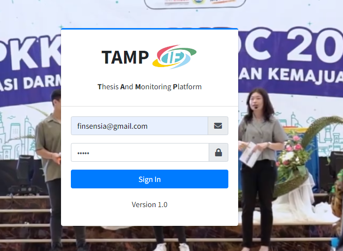
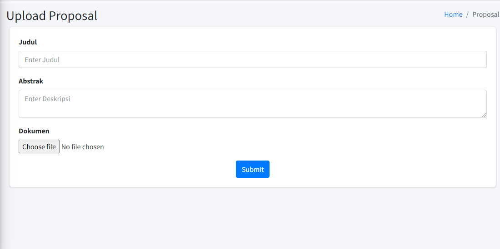
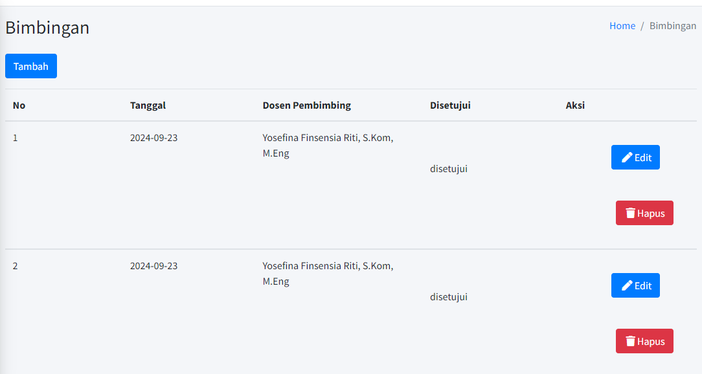
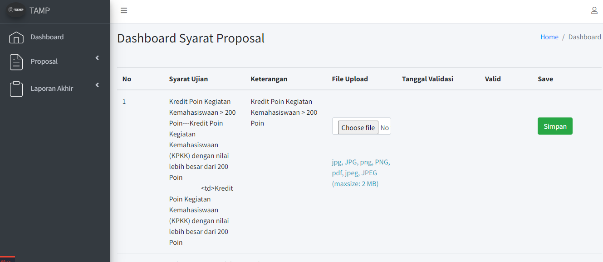

Nama : Audi Nathanael G
Prodi : Ilmu Informatika
NPM : 19340019
Kampus : Universitas Katolik Darma Cendika
Judul Skripsi : RANCANG BANGUN SISTEM MONITORING MAGANG DAN TUGAS AKHIR DENGAN PENDEKATAN DESIGN THINKING DAN SUS TESTING

Panduan mahasiswa:
1. Pengguna mengisi *email* dan *password* yang diberikan oleh admin

2. Pengguna dapat melakukan submit proposal terlebih dahulu dan dikonsultasikan dengan dosen pembimbing.

3. Pengguana dapat melakukan konsultasi bimbingan terhadap dosen di bimbingan

3. Pengguna dapat melakukan submit Tugas AKhir

4. Pengguna dapat melakukan submit syarat agar dapat melakukan proposal
